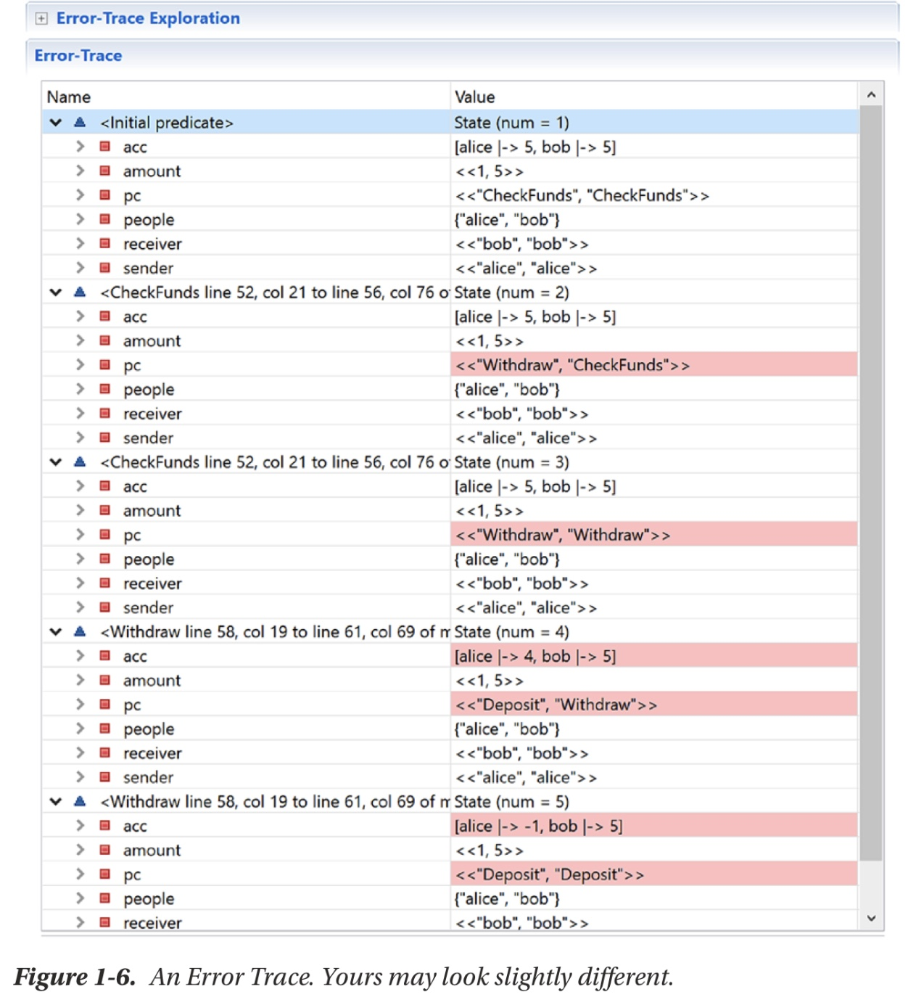
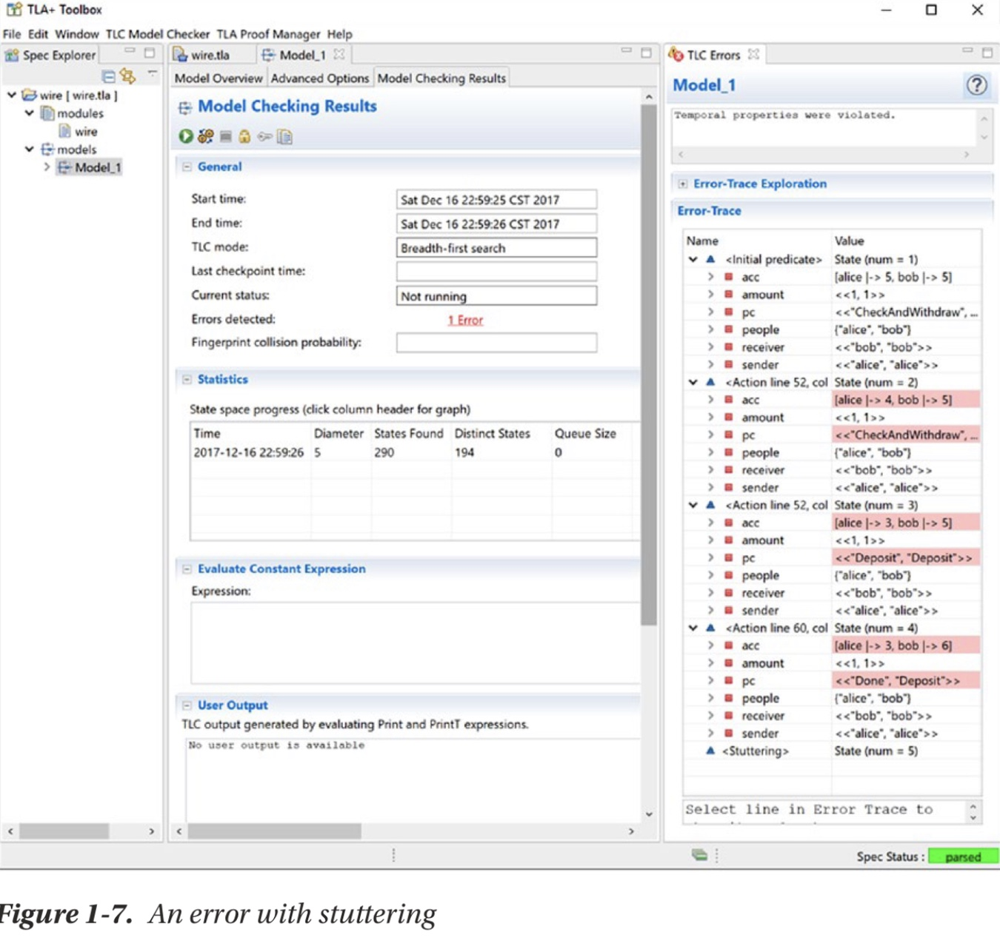

# 第1章 一个例子
## 1.1 问题域
银行，Alice和Bob是两个用户，银行提供了在线转帐的业务(wire＂：
* 每个转帐业务只在不同的两个银行客户之间进行，转帐金额最少一美元
* 若成功了，金额会从转出者的帐户减去，并加到转入者帐户上
* 若失败，两个账户都不受影响
* 不能让帐上金额为负
* 多个转帐可以同时进行

### 1.1.1 代码框架
ToolBox

### 1.2.2 定义规格
两件事要定义：人(帐户)的集合，以及每个帐号的金额

* 在`variables`中定义变量
* 在`define`区域中定义不变量


```
EXTENDS Integers 

(*--algorithm wire 
variables     
    people = {”alice“, ”bob“},     
    acc = [p \in people |-> 5],     
    sender = ”alice“,     
    receiver = ”bob“,     
    amount = 3; 

define     
    NoOverdrafts == \A p \in people: acc[p] >= 0 
end define; 

begin     
    skip; 
end algorithm;*)
```

### 1.1.3 实现算法


```
……
begin     
    Withdraw:         
        acc[sender] := acc[sender] - amount;     
        
    Deposit:         
        acc[receiver] := acc[receiver] + amount; 
end algorithm;*)
```

用plusCal写好后，可以转为TLA

> 在这个实现中，`sender`是转出方，我们用`Withdraw`和`Deposit`分别处理转出和转出帐户的处理。
> 

### 1.1.4验证
配置Model，指定不变量


### 1.1.5 更多的初值配置

修改amount初始值模式，可以甲范围方式

`amount \in 1..6;`

测试会失败，因为amount=6时违反了不变量NoOverdrafts的规定


## 1.2 并行处理

使用`process`。
把业务处理放到process里面。
还要加上对转出金额的检查

```
EXTENDS Integers 
(*--algorithm wire variables     
    people = {”alice“, ”bob“},     
    acc = [p \in people |-> 5]; 
    
define     
    NoOverdrafts == \A p \in people: acc[p] >= 0 
end define; 

process Wire \in 1..2     
    variables         
        sender = ”alice“,         
        receiver = ”bob“,         
        amount \in 1..acc[sender]; 
    
    begin     
    
        CheckFunds:         
            if amount <= acc[sender] then             
                Withdraw:                 
                    acc[sender] := acc[sender] - amount;    
                
                Deposit:                 
                    acc[receiver] := acc[receiver] + amount;         
            end if
            
end process; 
    
end algorithm;*)
```

仍然是`NoOverdrafts`错误。

可以通过`error trace`来分析错误原因：




- `Initial Predicate`是初始状态，所有的变量都在这里被赋值。`pc`表示了每个`process`的位置。
- 后面每一个状态中，发生变化的都被高亮标识出来。例如，中状态2中，执行完了第一个process的`CheckFunds`，准备执行`Withdraw`process，所以pc中的第一个变成了`Withdraw`。而第二个process还没有开始执行，因此它的pc标签仍然是`CheckFunds`。
- 在状态4，进程1的状态从`Withdraw`变到了`Deposit`，表示做了一次withdraw操作。因此，`acc[“alice”]`从5变成了4。通过阅读trace信息，我们就可以复原执行过程：

    1. 选择`amount[1]=1, amount[2]=5`
    2. 执行 `CheckFunds[1]`. 因`1<=acc[“Alice”]`, 处理到`Withdraw[1]`
    3. 执行`CheckFunds[2]`, 因`5<=acc[“alice]`，执行`Withdraw[2]`
    4. 执行`Withdraw[1]`，此时`acc[“Alice”]=4`
    5. 执行`Withdraw[2]`, 此时`acc[“alice]=-1`。错误。

这是一个同步问题。因为检查帐户和划出金额之间的并发竞争冲突。
修改为把两个动作放到同一个标签中：


```
process Wire \in 1..2     
    variables         
        sender = "alice",         
        receiver = "bob",         
        amount \in 1..acc[sender]; 
        
begin     
    CheckAndWithdraw:   \* 此处修改        
        if amount <= acc[sender] then                 
            acc[sender] := acc[sender] - amount;                
            
            Deposit:                 
                acc[receiver] := acc[receiver] + amount;         
        end if; 
end process;
```

## 1.3 时间属性
检查规则**若转帐失败，帐户不应变动**
换用一个稍微弱一些的规则：**帐户最后的总金额等于转帐前的总金额**

称为**Temporal Property**

时间属性和不变量的区别：
* 不变量会在每步执行后检查
* 时间属性在算法的每个可能的生命周期检查
* 类似于＂始终满足＂和＂最终满足＂的差别

需要在`define`中新增定义：`EveentuallyConsistent`


```
define     
    NoOverdrafts == \A p \in people: acc[p] >= 0     
    EventuallyConsistent == <>[](acc[”alice“] + acc[”bob“] = 10) 
end define;
```

> `<>[]`的意思是＂eventually-always＂

在`Model Overview`中添加时间属性名称
执行仍然错误：



第5步，出了错误**Stuttering**错误


