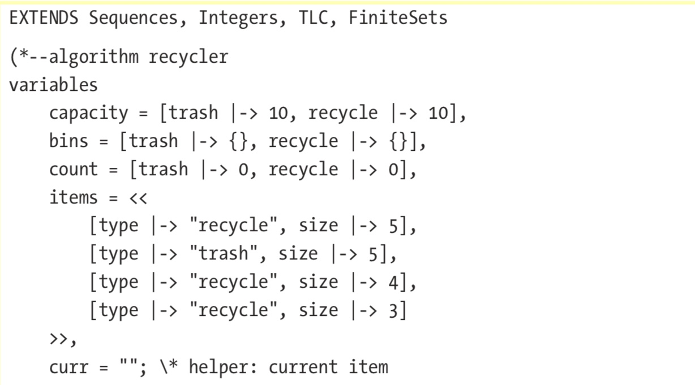

# 第2章 PlusCal
## 2.1 介绍
## 2.2 定义规格
### 2.2.1 规格的布局


1. 在**MODULE**前后各至少要有四个`-`，由至少四个`=`结尾
2. 模块名必须和文件名相同
3. `EXTENDS`导入外部模块，这里导入了`Integers `
4. `\*`是行注释，`(* ... *)`是TLA的块注释。PlusCal写在TLA的块注释中(这样TLA的解释器会忽略它），并由`- -algorithm <name>`开始，由`algorithm`结尾。`algorithm`的名字不需要和文件名一样
5. 在algorithm中，用`variables`标示初始化变量，变量之间用`,`隔开
6. 我们在这里写我们的算法


### 2.2.2 表达式
在TLA中，一切要么是表达式`Expressions`，要么是操作子`operator`。

expression evaluator


### 2.2.3 值
#### 基本值类型

TLA支持的值类型：string, integer, Boolean, 以及模型值(model value)。
不支持浮点数

支持的操作：


注意`=`和`:=`的区别：
* `=`是相等比较，`:=`是赋值
* 在纯粹的TLA中，只有相等比较，没有赋值。若x已初始化了并想将其与1比较，用`x=1`；若x已初始化了又想将它赋值为1，`x‘=1`
        
>         有点类似函数式语言的变量不变性？

#### Integers
* 支持`+, -, *, %, \div`
* 支持range定义：`a..b`，就是集合{a, a+1, ..., b}
> ⚠️ 一般函数式语言中，a..b指的是序列a,a+1,...,b-1。注意差别！

#### Set集合
通常意义上的集合，相同的类型，用花括号：`set ={1, 2, 3}`

支持的运算：


**filter**和**map**：
filter ：`{x \in set1 : y \in set2}`
map：`{expression: x \in set}`

#### tuple和sequence
是同一种数据结构。一般不变时叫元组，可变时叫序列
用`<<`和`>>`，可以不同类型
用`[序号]`来表示单个成员，⚠️下标从1开始
`EXTENDS Sequence`后支持：


#### Structures
实际是Map，不知为啥叫这个名字。访问成员的语法和一般C的结构成员语法一样

`[ key1 |-> val1, key2 |-> val2, etc ]`


```
variables 
    x = <<1, [a |-> {}]>>; 
begin   
    x[2].a := x[2].a \union {2};
    
```

### 2.2.4 算法描述

#### Assiment
`:=`

#### assert
`assert`

#### skip
`skip`，和Python的`pass`一样

#### if

```
if condition1 then   
    body 
elsif condition2 then   
    body 
else   
    body 
end if;
```

#### while

```
while condition do   
    body 
end while;
```
#### Macro 宏
* 在`begin`前定义
* TLA中没有作用域的概念，可以访问外部的变量
* 里面可以有赋值，`assert`，`if`语句，但不能有`while`循环
* 给一个变量最多只能赋一次值


```
macro name(arg1, arg2) begin   
    \* assignments 
end macro;
```

## 2.3 定义复杂的行为

### 2.3.1 多初始状态
为变量定初值时，可以指定多重值。

#### \in
`x \in set`  x可以取集合set中的任意值

#### SUBSET和UNION
集合的任意子集
多个集合的并集

#### \x
`set1 \X set2`得到一个元组的集合，元组的第一个成员来自set1，第二个来自set2
有点类似于`product`


```
>> {"a", "b", "c"} \X (1..2) 
结果为
{<<"a", 1>>, <<"a", 2>>, <<"b", 1>>, <<"b", 2>>, <<"c", 1>>, <<"c", 2>>}
```

#### [key: set]
由两个集合`key`和`set`组合生成的结构。两者都必须是集合！

⚠️和`[key |-> val]`区分：

```
>> [a: {"a", "b"}] 
{[a |-> "a"], [a |-> "b"]} 

>> [a: {"a", "b"}, b: (1..2)] 
{ [a |-> "a", b |-> 1], [a |-> "a", b |-> 2], [a |-> "b", b |-> 1], [a |-> "b", b |-> 2] }
```


### 2.3.2 定义非确定性行为

#### either

指行为定义中，定义可能的情况。各种选择是平等的。
> 比如，可能这样，可能那样。


```
either   
    \* branch 1 
or   
    \* branch 2   
    \* ...
or   
    \* branch n 
end either;
```

#### with

两种形式。
第一种，仅仅是定义了一个临时变量来使用：
```
with var = value do   
    \* body 
end with;
```
第二种，TLC会对所有在set中的var来检查要做的动作：

```
with var \in set do   
    \* body 
end with;
```

## 2.4 Example 

### 2.4.1 垃圾桶问题
1. 垃圾分成两类：可回收recyclable和废弃trash
2. 每种垃圾桶都只有有限的存放空间
3. 一件垃圾的处理：
    1. 若为＂可回收＂，且可回收桶放得下，就放进去，若可回收桶放不下，且废弃桶还有空间，就放那里
    2. 若垃圾是废弃物，且废弃物桶有地方，就放进去
    3. 若没有地方，就扔到地上

#### 思考如何进行抽象和建模
* 两个垃圾桶的大小用数字表示
* 每件垃圾有两个属性：种类和大小，我们用一个结构来表示它，例如：`[type |-> "trash", size |-> 2]`
* 垃极桶内物品可以用一个集合来表示
* 用一个序列来表示垃圾到来，如`<<item1, item2, item3>>`

不变量：


#### 版本1





用宏来简化：


#### 版本2

定义更复杂的初始值：
* 每个垃圾桶的大小不再是固定的值
* 每件垃圾的大小和种类也都自动生成：


总共有$10 × 10 × (2 × 6)^4 = 2,073,600$种状态

这个实现有错误，TLC会执行失败。

> 因为`bins`中每样垃圾都用集合实现，而集合是不支持重复的，所以，导致在向垃圾桶里放东西时，可能会因重复而丢弃，导后出现不一致。

可以把`bins`里面的垃圾桶建模为序列：


这个实现对了，这有9,323,626个状态
> 这状态数倒底是咋算出来的？


### 2.4.2 消息发送问题
消息收发问题。
* 发送者把消息发出去
* 接收者可能会收到消息，也可能收不到？**还是说没能及时收到？**
* 不能保证接收到的消息的次序和发送一致

#### 模型设计
发送的消息和已收到的消息是有先后顺序的，分别用一个`sequence`来表示
传输过程是不保证顺序的，用`set`来表示
> 用set，就意味着消息决不能出现重复。但对验证问题域而言，建模的重点不在于此。

#### 代码版本1


> 这个例子中，发送和接收是同步的
> 收处理中，有`either`两个分支，第一个分支模拟消息处理
> ⚠️**第二个分支？**这个分支模拟的是丢了一条消息还是这个循环中没收消息，而消息仍在网络上等待接收？－－似乎是后者？
> receive分支中用`\in`从集合`in_transit`中取一个成员，模拟了传输乱序的现象
> 书上说不能保证`received = <<1, 2, 3>`。
> 这里因为书中还没有讲到并发，所以应是用这个`skip`来进行了一定 程度的模仿。但这种模仿，引入的一个情况是，当走到接收时，`in_transaction`总是非空的

#### 版本2．解决传输顺序问题
利用发送-确认机制


代码笔记
> `can_send`控制`sender`能不能发消息。每发一条就变成FALSE，当`receiver`收到后才改为TRUE——用来模拟响应消息
> 在`or`分支中没有处理，于是`can_send`就一直是FALSE，就**挂死**了——死锁
