# 第3章 Operator和Function

> 它的叫法很别扭，Operator以后叫＂算子＂，Function 还叫＂函数＂。真难受！


## 3.1 Operator

有些类似于一般编程语言中的函数/过程。
无参数时不用写
用`==`定义：
* `Op(arg1, arg2) == Expr`
* `Op == Expr`


> 它可以当宏用，也可以当变量用

垃圾桶例子中的改进：

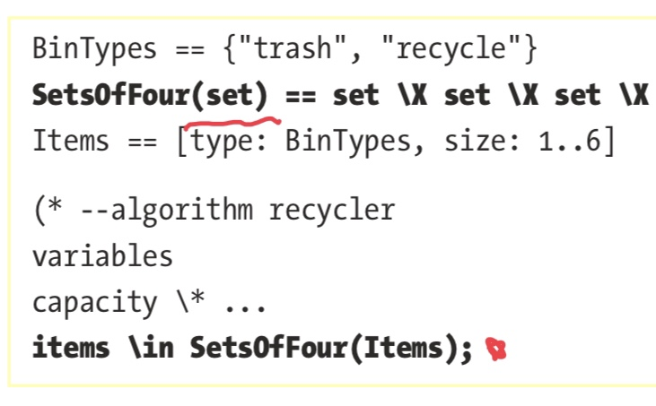

若要在算子中用PlusCal算法中定义的变量，则要把它放在`define`块中：必须在宏定义之前，变量定义之后。


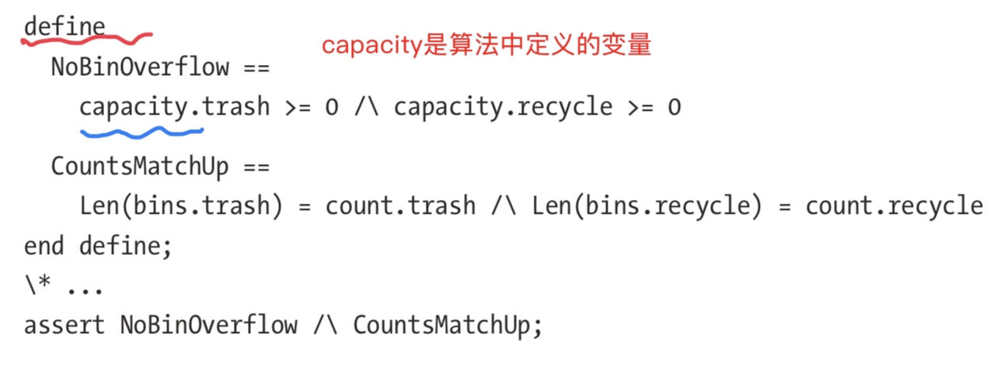

####  /\的特别的用法

为了美观，第一个前面也可以放一个`/\`或`\/`这种：
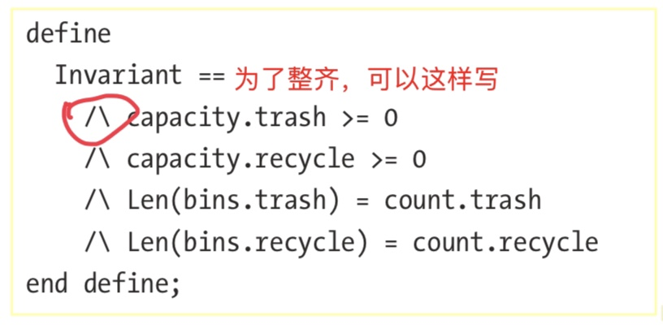

缩进表示嵌套括号：

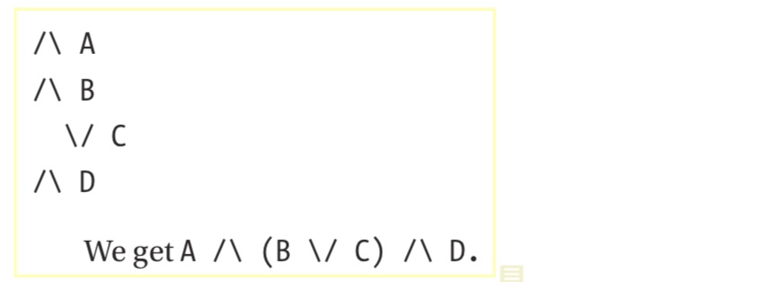

#### 算子中支持Lambda和高阶函数

LAMBDA和高阶函数
```
Add(a, b) == a + b 
Apply(op(_, _), x, y) == op(x, y) 

>> Apply(Add, 1, 2) 
>> 3

Apply(LAMBDA x, y: x + y, 1, 2) >> 3

```


#### 集合++和—


```
set ++ elem == set \union {elem} 

set -- elem == set \ {elem}
```

## 3.2 不变量
是布尔表达式
在模型每一步执行结束后都会检查

### 3.2.1 Logical Operator
用来表示更复杂的关系

#### \A
＂集合中的每一个成员＂
空集的\A为真

检查set中是否所有的成员的值都小于max：
`AllLessThan(set, max) == \A num \in set: num < max`


#### \E
＂集合中至少有一个成员……＂
⚠️ 空集的\E为假

下面检查一个序列中是否至少有一个成员在集合set中：
```
SeqOverlapsSet(seq, set) == \E x \in 1..Len(seq): seq[x] \in set

>> SeqOverlapsSet(<<1, 3>>, {2, 3, 4}) 
TRUE
```

#### \A和\E的例子

＂commutative＂算子，指的是参数的次序不影响结果，例如，add(a,b)==add(b,a)

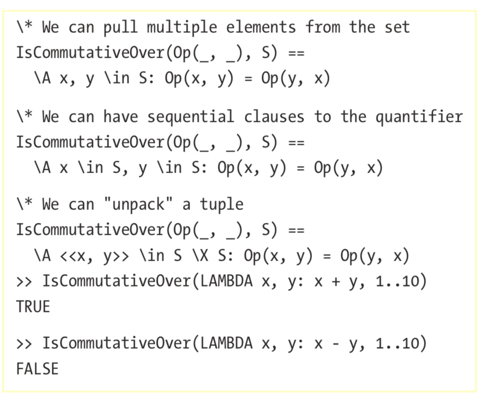


#### => 和 <=>

`P => Q`的意思是，若P为真，则Q为真
> 这个好奇怪

`P <=> Q`的意思是，P和Q要么都为真，要么都为假。
> 等价的意思


```
Xor(A, B) == (~A /\ B) \/ (A /\ ~B) 
OtherXor(A, B) == ~A <=> B 

>> \A A \in BOOLEAN, B \in BOOLEAN: Xor(A, B) = OtherXor(A, B) 
TRUE
```

### 3.2.2 表达式中可以用到的

#### LET-IN
用来定义表达式中用到的局部算子和定义

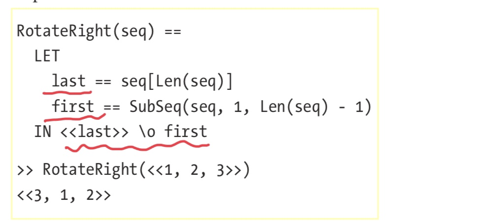

> 它的意思是，`LET`中定义，给`IN`中的表达式用
> 在LET中定义了last和first两个算子，给后面的表达式`<<last>> \o first`使用

#### IF-THEN-ELSE
> 要注意和前面的2.2.4中的if语句的区别。这个是表达式，而`if`则是语句，不一样的


```
Max(x, y) == IF x > y THEN x ELSE y 

>> <<Max(2, 3), Max(3, 2)>> 
<<3, 3>>
```

#### CASE


```
CASE x = 1 -> TRUE   
    [] x = 2 -> TRUE   
    [] x = 3 -> 7   
    [] OTHER -> FALSE
```

#### CHOOSE

`CHOOSE x \in S : P(x)`

若x没有找到匹配，TLC会产生错误


```
IndexOf(seq, elem) ==   CHOOSE i \in 1..Len(seq): seq[i] = elem 

>> IndexOf(<<8, 3, 1>>, 3) 
2

>> IndexOf(<<8, 3, 1>>, 4) 
Attempted to compute the value of an expression of form CHOOSE x \in S: P, but no element of S satisfied P.
```


```
Max(set) == CHOOSE x \in set: \A y \in set: x >= y 

>> Max(1..10) 
10
```

下面是实现解方程$2x + y =  − 2 and 3x − 2y = 1$

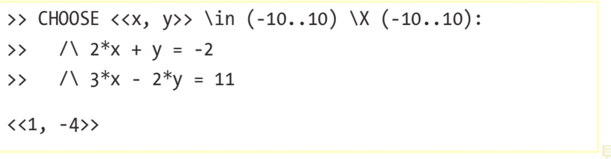

## 3.3 Function 函数
它其实是一种映射。它定义了集合到集合的映射：
` [x \in set |-> P(x)]`
也支持输入是多个集合：
* `[x, y \in set |-> P(x, y)]`
* `[x \in set1, y \in set2 |-> Q(x,y)]`

调用函数：`f[bar]`

> struct和function的差别。struct是值到某种类型，function是集合到集合

tuple和struct是特殊的函数：
* tuple的域是1，..n
* struct的域是字符串的集合


```
Flags == {"f1", "f2"} 
(*--algorithm flags 
variables   
    flags = [f \in Flags |-> FALSE]; 
begin   
    with f \in Flags do
        flags[f] := TRUE;   
    end with; 
end algorithm; *)
```

### 3.3.1 函数和算子

可以把函数用作算子，若没有参数，下面两种写法都对：

```
Op == [x \in S |-> P(x)] 
Op[x \in S] == P(x)
```
算子可以是任何输入，函数必须是特定的域


```
SumUpTo(n) ==   
    LET F[m \in 0..n] ==     
        IF m = 0 THEN 0     
        ELSE m + F[m-1]   
   IN F[n] 
   
>> SumUpTo(10) 
55
```

用PT库的`ReduceSet`来实现：
```
PT == INSTANCE PT 

SumUpTo(n) ==   
    PT!ReduceSet(LAMBDA x, y: x + y, 0..n, 0) 

>> SumUpTo(10) 
55
```

#### 域DOMAIN

就是函数的输入

若`func == [x \in set |-> ...]`,则 `DOMAIN func = set`
`DOMAIN seq = 1..Len(seq)`
`DOMAIN struct`是所有Key的集合

#### @@
要先`EXTENDS TLC`
`f @@ g`：merge两个函数一一域为f和g的域的并集，且若x既在f的域内又在g的域内，则为f[x]，否则g[x]

```
Merge(f, g) == [   
    x \in (DOMAIN f) \union (DOMAIN g) |->     
        IF x \in DOMAIN f THEN f[x] ELSE g[x]   
   ]
```


```
EXTENDS TLC 
f[x \in 1..2] == "a" 
g[x \in 2..3] == "b" 

>> f @@ g 
<<"a", "a", "b">> 
>> g @@ f 
<<"a", "b", "b">>
```

#### :>
也要先`EXTENDS TLC`。

`a :> b`就是函数`[x \in {a} |-> b]`的简写
> 后面似乎也没有见过

### 3.3.2 函数的集合 [set1 -> set2]

`[set1 -> set2]`是把`set1`的成员映射到`set2`的所有函数的集合
⚠️ 区分函数和函数集合：
⚠️ 它和2.3.1中的[key:set]的差别要再辩析一下

```
>> [s \in {"a", "b"} |-> {1, 2}] 
[a |-> {1, 2}, b |-> {1, 2}] 

>> [{"a", "b"} -> {1, 2}] 
{ [a |-> 1, b |-> 1],      
[a |-> 1, b |-> 2],      
[a |-> 2, b |-> 1],      
[a |-> 2, b |-> 2] }
```

重构`item \X item \X item \X item`：
定义`SeqOf(set, count)`：

```
SeqOf(set, count) == [1..count -> set]

>> SeqOf({"a", "b", "c"}, 2) 
{ <<"a", "a">>, <<"a", "b">>, <<"a", "c">>, <<"b", "a">>, ... }
```

另一个例子：

```
Flags == {"f1", "f2"} 
(*--algorithm flags 
variables   
    flags \in [Flags -> BOOLEAN] 
begin
    \* . . .
```
>  ⚠️书上说这样有15个状态？但明明是4个啊！{f1,f2}->{t,f}应当是4个！

至少有一个flag为true的写法：

```
flags \in {config \in [Flags -> BOOLEAN]: \E f \in Flags: config[f]}
```
> ⚠️ 分析不清这个结构，交织在一起了！

## 3.4 例子
### 3.4.1  问题描述
背包中怎么放东西最优的问题
* 背包有容积N
* 有几类物品，每类物品有大小（体积）和价值
* 怎样选择物品的组合才能带走价值最高

### 3.4.2 初值建模
> 给初值建模，其实就是各种测试的初始状态

#### 3.4.2.1 背包
背包只有一个容积的属性，用一个数字就可以
`Capacity == 7`

#### 3.4.2.2 物品种类
物品的种类用一个set就可以：
`Items == {”a“, ”b“, ”c“}`

#### 3.4.2.3 每类物品的个数，体积和价值
 每类物品的尺寸和价值，size和value属性。
 
 
##### 3.4.2.3.1 第一种表示
用一个set来表示，用名字来标识不同的物品。
比如，用硬编码方式给出一个物品属性定义：
```
HardcodedItemSet == {   
    [item |-> ”a“, size |-> 1, value |-> 1],   
    [item |-> ”b“, size |-> 2, value |-> 3],   
    [item |-> ”c“, size |-> 3, value |-> 1] 
}
```
这样写，找某种物品就比较麻烦：

```
ValueOf(item) == (CHOOSE struct \in HardcodedItemSet: struct.item = item).value

>> ValueOf("a")
```
而且，还无法确保数据的正确性，例如，若两类物品名字写相同了

> 我的理解是，在用TLA验证设计，如果在这里设计使用了某种数据结构，那么在真正的产品开发中也应用相同属性的机制，例如，这里用了字典，在代码中就不应用数组。

##### 3.4.2.3.2 第二种表示
把物品的属性信息实现为字典（结构），key是物品的名称。

```
HardcodedItemSet == [   
    a |-> [size |-> 1, value |-> 1],   
    b |-> [size |-> 2, value |-> 3],   
    c |-> [size |-> 3, value |-> 1] 
]
```

##### 3.4.2.3.3 最终 

```
ItemParams == [size: 2..4, value: 0..5]

ItemSets == [Items -> ItemParams]
```

> `ItemParams`定义了`size`属性取2..4的值，而`value`属性取0..5
> 参见2.3.1，[key:value]语法。

>  `ItemSet`则是形成了一个物品种类和物品属性的组合全集。看3.3.2


### 3.4.3 有效的物品组合
放到包里的物品的条件：
1. 每类物品个数不能超过它有的个数
2. 总体积不能超过背包的容积

#### 3.4.3.1 物品选择方案的表示
就是每种物品的个数
它的形式是`[Items -> Count]`，
* `Items`是物品的名称的集合，
* `Count`是个数的范围，以后可以作为模块值提供。

#### 3.4.3.2 选择的物品总体积不能超过包的大小
>  用了`PT!ReduceSet`，和其他语言的`reduce`一样的


```
KnapsackSize(sack, itemset) ==   
    LET size_for(item) == itemset[item].size * sack[item]
    IN PT!ReduceSet(LAMBDA item, acc: size_for(item) + acc, Items, 0) 
    
ValidKnapsacks(itemset) ==   
    {sack \in [Items -> 0..4]: KnapsackSize(sack, itemset) <= Capacity}
```

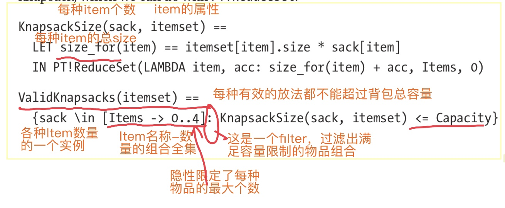

### 3.4.4 选择最优解
从有效的物品组合方案中选择价值最高的

#### 3.4.4.1 实现1：有缺陷的实现

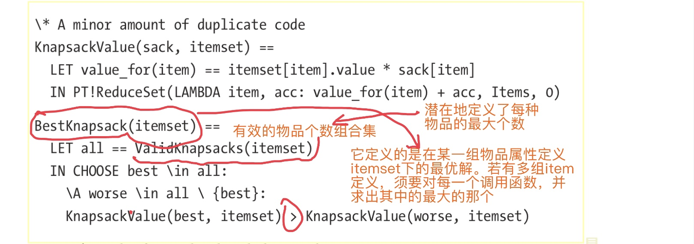

> `KnapsackValue`计算了`sack`中的物品的总价值：
> `sack`是当前的物品组合方案，即每类物品的个数
>   `itemset`则是物品的属性定义，即每类物品的大小和价值。在这里用了它的价值属性一一`value`。
> `itemset`是前面的`itemsets`中的一个成员

> `BestKnapsack`则是从所有的物品个数组合中选择基于物品属性定义`itemset` 中选出价值最高的那个：
> `all`是基于`itemset`下所有的满足背包容积限制的所有的可能组合
> 然后用`CHOOSE`选样价格最高的那个

这个算法对单个的`itemset`计算正确：

```
>> BestKnapsack(HardcodedItemSet) 
[a |-> 1, b |-> 3, c |-> 0] 

>> KnapsackValue([a |-> 1, b |-> 3, c |-> 0], HardcodedItemSet) 
10
```
但当用来从一组`itemset`里面选时出错了：

```
>> {BestKnapsack(itemset) : itemset \in ItemSets} 
Attempted to compute the value of an expression of form CHOOSE x \in S: P, but no element of S satisfied P.
```
错误叫`no element of S satisfied P`

> 书中讲了怎么分析和定位问题：加了一个断言：

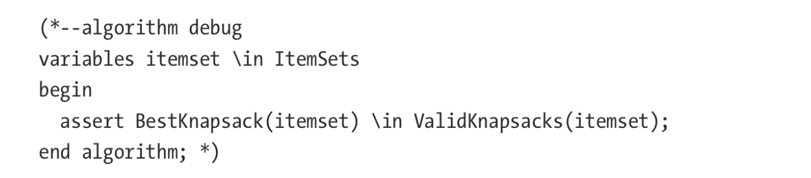
>  然后执行检查：

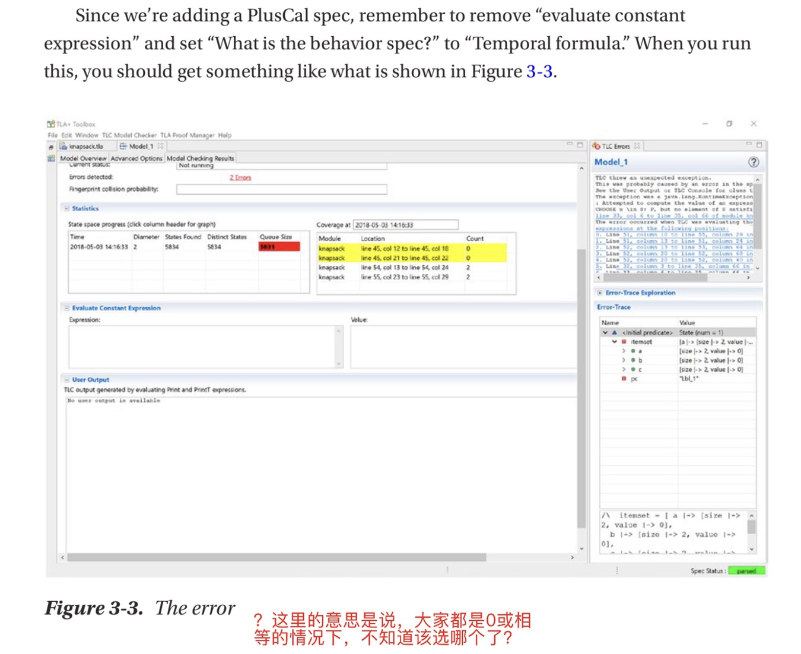

> 这里的错误似乎在这个`KnapsackValue(best, itemset) > KnapsackValue(worse, itemset)`的**>**上。如果改成`>=`似乎就可以避免这个错误
> 
> 但书中说：`CHOOSE `在面临多个可以的选择的时候是**任意（arbitrarily）**选择其中的一个，这个做法未必与你的期望一致
> 从这里可以看到，核心并不是实现，而是期望，是规格。作者认为，**由于实际上就可能找到多个平等的最优解，因此软件应返回所有的结果而不是＂猜＂其中的一个**

#### 3.4.4.2 找出所有的价值最高的
把所有的分法都找出来。有两种做法：
##### 第一种

找出那些比其他的价值高的组合


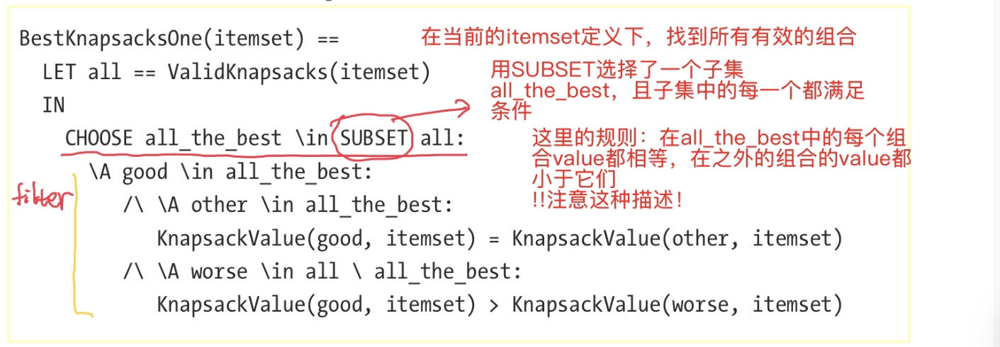

> 还是给定物品的属性，找各种组合方法
> `all`还是所有有效的组法的集合
> 两个and条件
> 很拗口

##### 第二个算法
先选出任一个最好的，再找出所有其他的和它相等的

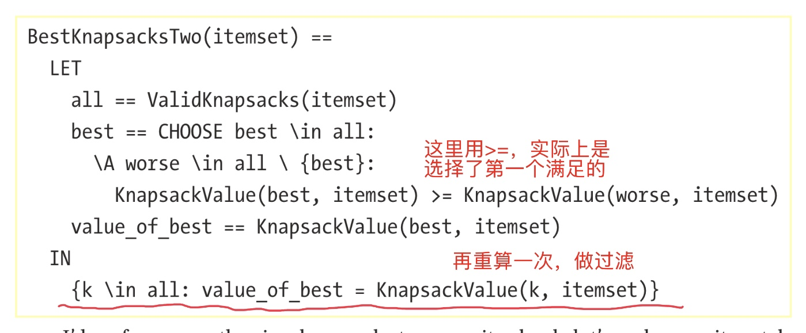

> 这个算法看上去很笨拙，效率也低，但比上一个却是高得多！

##### 比较两个算法
两个算法的结果并不一致！

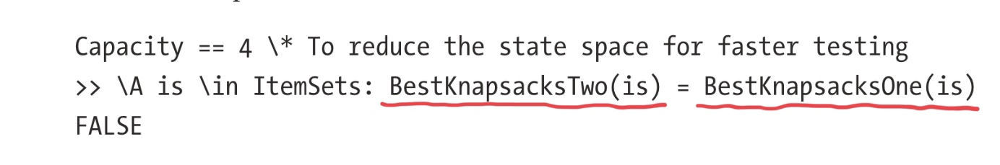

调试，找一下哪些`itemset`两个算法不一样：

```
LET is == CHOOSE is \in ItemSets:   
    BestKnapsacksTwo(is) /= BestKnapsacksOne(is) 
IN <<is, BestKnapsacksOne(is), BestKnapsacksTwo(is)>>
```

……
> 没看懂😺

##### 改正

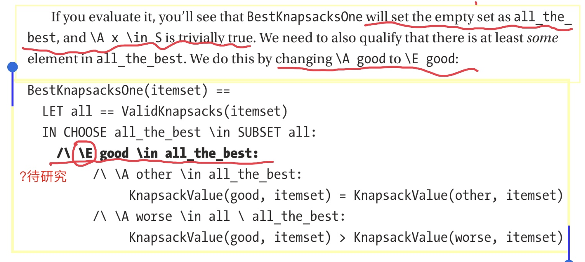


#### 3.4.5 优化
最后选样`BestKnapsacksTwo`，去掉`KnapsackValue`调用，直接写进去，得到最后的版本;


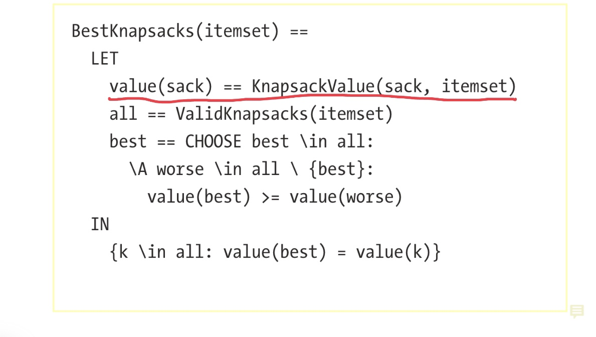


