# 第5章 并发

在并发（**concurrent** ）系统中，没有单一的**timeline** 。
两个概念：`process`, `label`

## 5.1 Label标签
标签决定了规格中的原子性的粒度（*grain of atomicity*）
TLC一＂步（Step）＂执行完一个标签定义的内容，然后检查所有的不变量并找出下一个可能要执行的所有的标签并进行测试。
> ⚠️不知是不是我的理解有错误。原文：
> Labels determine the grain of atomicity of your spec. TLC executes everything in a label in a single step, or action. Then it checks all invariants and looks for the next label to execute (action to take).
> 这里的问题是，当标签内又有标签时点样行为？一个single step里执行最内层的标签还是最外层的？
> 

`pc`，指的是＂program counter＂，指的是当前所在的标签。

可以用`goto `在本`process `中跳转

使用Label规则：

- 在每个process开始处和每个while前都要加Label
- 在macro和with内部不能有Label
- 在每个goto后必须放一个Label
- 若你在if或either的分支中有Label，则在此结构结束处必须有Label
- 在一个Label内部不允许给一个变量赋值两次

非法，因为对`struct`重复赋值了

```
Invalid:   
    struct.key1 = 1;   
    struct.key2 = 2;
```
可以改成这样：

```
Valid:   
    struct.key1 = 1 ||   
    struct.key2 = 2;
```

## 5.2 Process 进程

在进程中必须明确使用标签

写一个读写的例子：

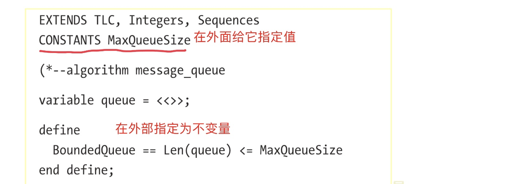

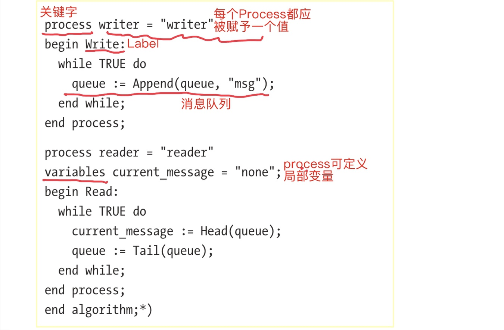

TLC会任意选择进程来执行，执行其中的一个标签，计算不变量，然后从下一个要执行的进程中选待执行的标签运行。
并发下，`pc`不再是单个的值，而是一个函数

进程也可以有**局部变量**，如`reader`进程的`current_message`。
宏可以用调用它的进程定义的局部变量

配置模块变量`MaxQueueSize <- 2`，指定`BoundedQueue`为不变量。
模型执行失败：
若先执行`reader`，队列为空，`Head`行为未定义

### 5.2.1 await
`await`阻塞进程，直到它的表达式为真。

把`reader`进程改写：

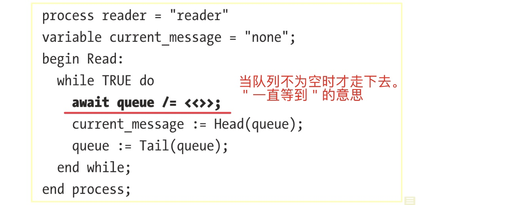
> 于是，在消息队列`queue`为空时，读进程就被阻塞了。

写进程也要改写，当队列满时也要阻塞：

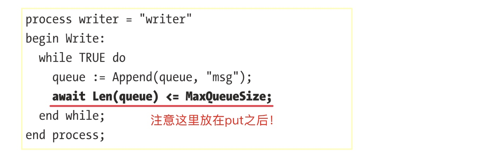

> 作者在这里把`await`放在写队列之后。若放在前面，要把`<=`攻成`<`


### 5.2.2 死锁

产生死锁的例子：
`reader`也可能向队列中写消息一一即，`reader`实际上既是读者，也是写者，即两个进程竞争消息队列了


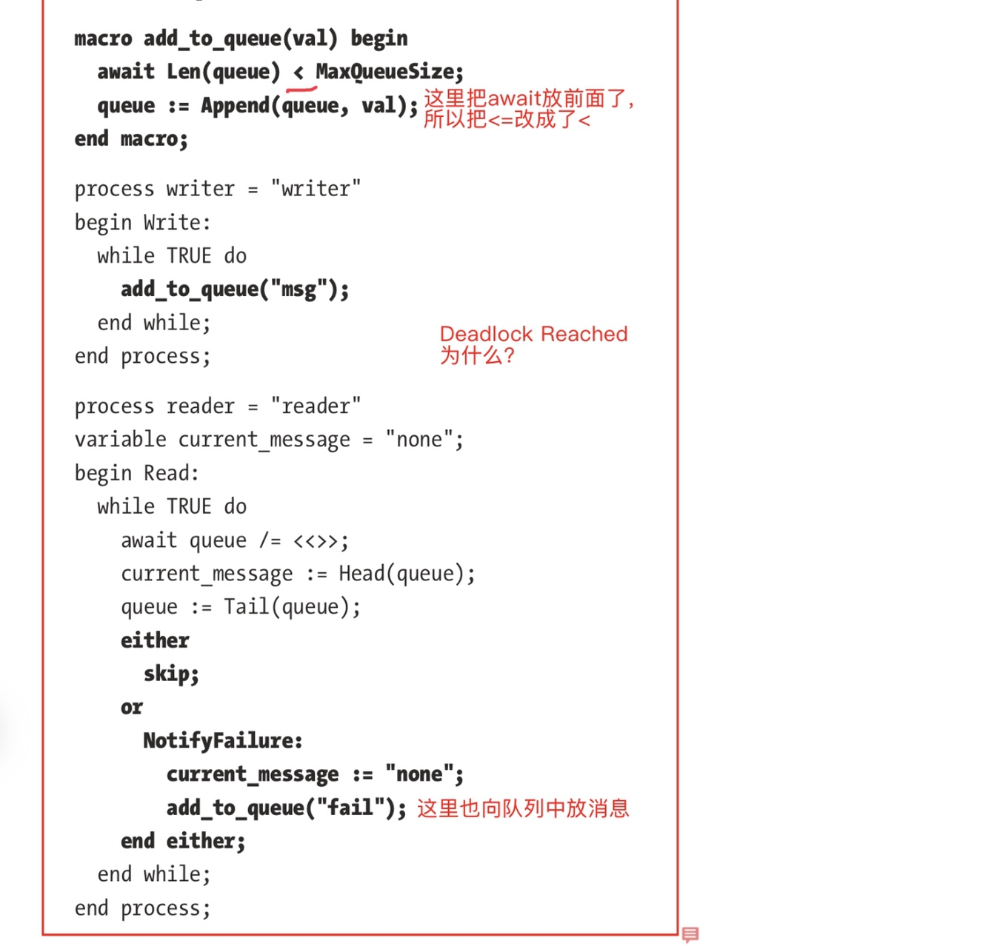

> 死锁产生的情况是，`writer`把队列写满了，`reader`运行，`either`分支走到了`NotifyFailure`，于是阻塞。这样两个进程都阻塞在队列满上。

死锁通常是由`await`引起的，另一种可能引起死锁的情况是语句`with x \in S`，当`S`为空集时。

关闭死锁检查：**`Model Overview > What to Check? > Deadlock`**

#### 5.2.2.1 Process Sets进程集

上面例子中的死锁问题的一种可能的应对措施是再加另一个读进程，当陷入死锁之后，指望第二个`reader`来＂吐＂一个队列成员出来。
> 这个当然不靠谱。只是演示一下进程集的使用。


```
process reader \in {"r1", "r2"} 
variable current_message = "none"; 
begin Read:   
    while TRUE do     
        await queue /= <<>>;     
        current_message := Head(queue);     
        queue := Tail(queue);     
        
        either       
            skip;     
        or       
            NotifyFailure:         
                current_message := ”none“;      
                add_to_queue(self); 
        end either;   
   end while; 
end process;
```
几点：
1. 创建两个`reader`：`process reader \in {”r1“, ”r2“}`。有3个进程：“writer” ， “r1” ，“r2”。
2. `self`指自己


## 5.3 Procedure 过程

> 宏里面不能用标签，用过程
> 调用过程时要用`call`


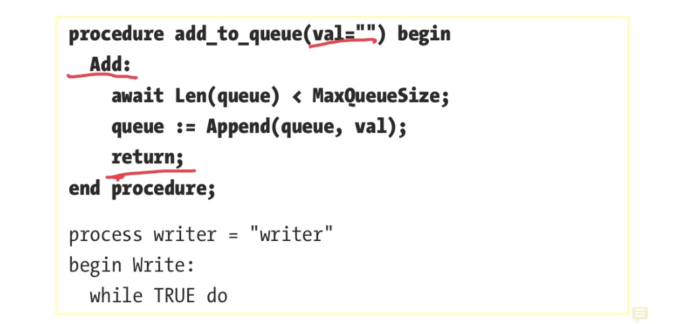

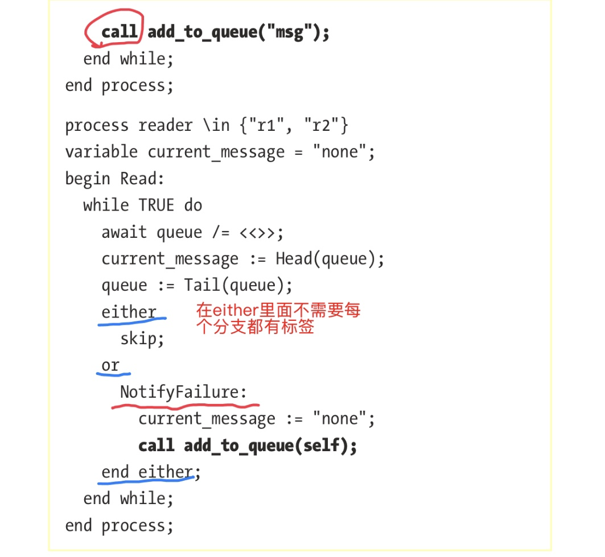
> 一样会死锁

使用过程的规则：
1. 过程和宏语法相同，只是可以在里面定义标签
2. 可以和进程一样定义局部变量，但只能用`=`，不支持`\in`
3. 退出过程用`return`
4. 调用过程要用`call`，调用语句的后面必有紧跟着下面之一：标签、enclosing block的尾部、`goto`或`return`
5. 过程必须在宏的定义之后，在进程定义之前


## 5.4 案例
用进程来给**定时活动**建模：
1. 几个Client 消耗共享资源
2. 共享资源会被定时刷新

### 5.4.1 不考虑资源刷新


```
EXTENDS Integers 
CONSTANT ResourceCap, MaxConsumerReq 
ASSUME ResourceCap > 0 
ASSUME MaxConsumerReq \in 1..ResourceCap 

(*--algorithm cache 
variables 
    resources_left = ResourceCap; 
    
define   
    ResourceInvariant == resources_left >= 0 
end define; 

process actor = ”actor“ 
    variables   
        resources_needed \in 1..MaxConsumerReq 
    begin   
        UseResources:     
            while TRUE do       
                await resources_left >= resources_needed;
                resources_left := resources_left - resources_needed;     
           end while; 
 end process; 
 end algorithm; *)

```
### 5.4.2 添加资源刷新


```
process time = "time" 
begin   
    Tick:     
        resources_left := ResourceCap;     
        goto Tick; 
end process;
```

> 这里仅仅就是跑到了就刷新资源，没有什么时间控制

### 5.4.3 增加多消费者

增加多个消费者，为`actor`增加一个集合`Actors`


```
EXTENDS Integers 
CONSTANT ResourceCap, MaxConsumerReq, Actors

ASSUME ResourceCap > 0 
ASSUME Actors /= {} 
ASSUME MaxConsumerReq \in 1..ResourceCap 

(*--algorithm cache 

variables resources_left = ResourceCap; 

define   
    ResourceInvariant == resources_left >= 0 
end define; 

process actor \in Actors 
variables   
    resources_needed \in 1..MaxConsumerReq; 
        
begin   
    WaitForResources:     
        while TRUE do       
            await resources_left >= resources_needed;       
            resources_left := resources_left - resources_needed;
       end while; 
end process;

process time = "time" 
begin   
    Tick:     
        resources_left := ResourceCap;     
        goto Tick; 
end process;

end algorithm; *)
```

> 在这个实现中，actor启动时一次性拿走了所需的资源。下个例子中则是随用随取的。

### 5.4.4 运行中逐渐消耗

上个例子中，在开始运行时一次性消耗资源。下面改为运行中逐渐消耗。
进程启动时检查一下是否有足够的资源，运行中消耗前不做检查，直接扣除。
> 当然会出错！


```
process actor \in Actors 
variables   resources_needed \in 1..MaxConsumerReq; 

begin   
    WaitForResources:     
        while TRUE do
            await resources_left >= resources_needed;     
            UseResources:
                while resources_needed > 0 do           
                    resources_left := resources_left - 1;
                    resources_needed := resources_needed - 1;         
                end while;
                with x \in 1..MaxConsumerReq do     
                    resources_needed := x;         
                end with;     
      end while; 
 end process;
```

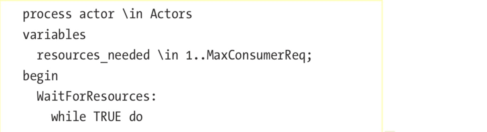

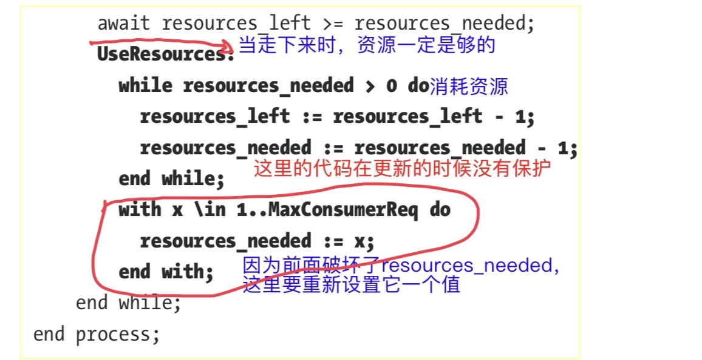

> 这里的while循环总是不习惯！

这段程序会运行失败。
> ⚠️这里我还是没有理解，标签倒底是什么用途：
> 一个actor中有两个标签：外层的`WaitForResources`和里层的`UseResources`。从标签的定义看，如果我理解为最小执行单元的话，
> ⭐️它的意思应该是这样的：在await和UseResources标签之间会被其他actor抢占？但WItForResources呢?

修改版本：

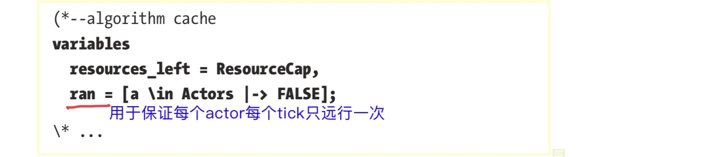
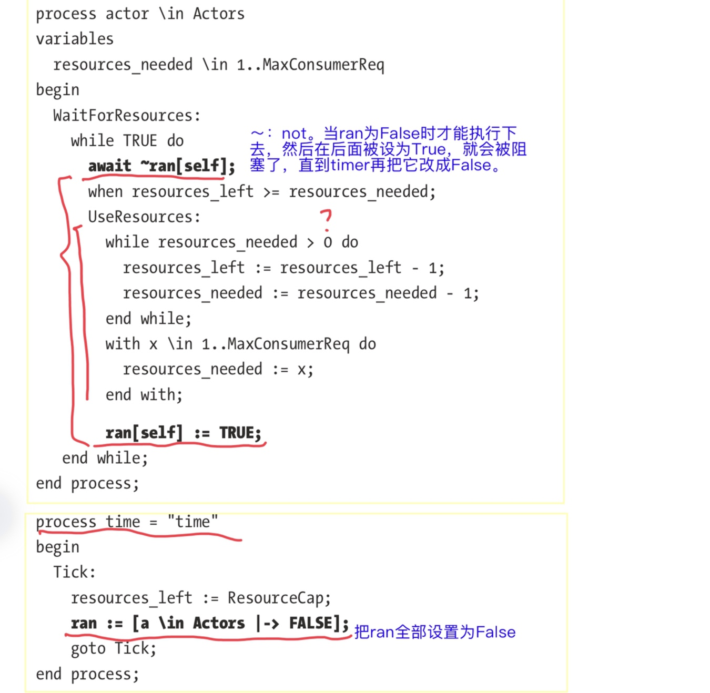

代码中加了一个全局变量`ran`，用于限制每个actor每个click只能执行一次。
>⁉️没明白为什么轮着跑就没有问题

> 更新：
> 好像是让资源总量大于所有actor的总需求？

### 5.4.5 再扩展
再扩展，可用的资源数变成一个变化的值：


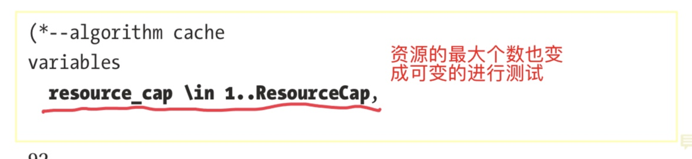

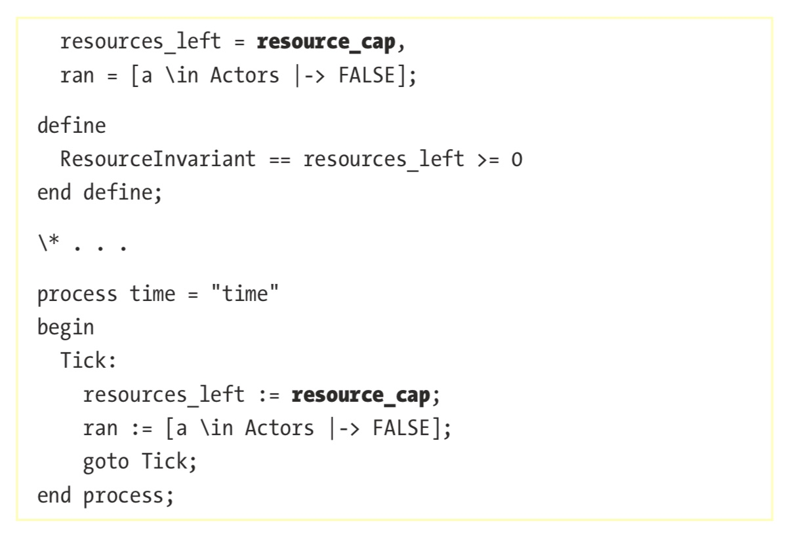

这样又一次执行失败。因为每个actor的需求都可能是总可用资源数，导致上个例子的成功条件又不满足了。

### 6.4.6 使用信号量(1)

使用信号量机制：检查信号量的值。
在TLC中，信号量是一个全局数字值即可

```
variables   
    resource_cap \in 1..ResourceCap,   
    resources_left = resource_cap,   
    reserved = 0; \* 信号量
define   
    ResourceInvariant == resources_left >= 0 ，，
end define; 

process actor \in Actors 
variables   
    resources_needed \in 1..MaxConsumerReq 
begin   
    WaitForResources:     
        while TRUE do       
            \* ✍🏻在这里reserved表达的意思应该是当前已被占用(保留了)的
            \* 数量。这个表达式的意思是，已经被其他actor占用的资源
            \* 数量。这个表达式的意思是本次actor要占用的资源的和之前
            \* 被其他actor所占用的资源的总和不能超过剩余资源量
            \*❗️明显这里的实现逻辑是错的。
            await reserved + resources_needed <= resources_left;       
            reserved := reserved + resources_needed;       
            UseResources:         
                while resources_needed > 0 do           
                    resources_left := resources_left - 1;           
                    resources_needed := resources_needed - 1;
                    \* ❗️如前所示，这里reserved没有更新，不对的。
               end while;         
               with x \in 1..MaxConsumerReq do           
                   resources_needed := x;         
              end with;     
         end while; 
         
\* 2 
process time = ”time“ begin   
    Tick:     
        resources_left := resource_cap;     
        ❗️这里有严重的错误。reserved清零之后，状态就彻底混乱了
        reserved := 0;
        goto Tick; 
end process;
```
> 这个例子中信号量的使用也是很诡异的。
> 甚至，更进一步，有可能


#### 6.4.6.2 修改
两处修改：
1. 在`actor`中，也递减reserved的值
2. 在`time`中不清零信号量了

    > 这才像是信号量的使用

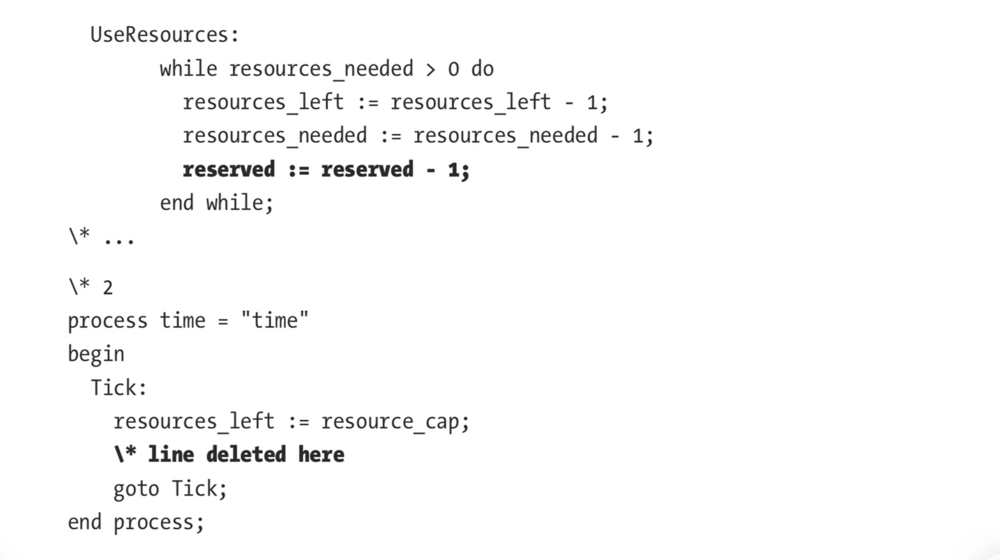

## 总结
我的理解：
1. 并发，就是TLC通过验证多个process的各种可能执行时序，来检查这个过程中不变量或其他的指标是否正确
2. 标签，个人**原先**理解它**可能**应该就是类似于一个不可被抢占的代码的意思。因为文中说，它是`grain of atomic it’s `，又说TLC会执行`everything in a label in a single step`。
3. ⚠️但是否真的如此还要再去了解一下。因为书中接着说的是，执行一个标签之后会检查不变量等东西。而一般情况下，TLC是在执行每一个`step`之后就检查。因此，这里的标签也可能仅仅表示检查的粒度，而不是它不可被打断
4. 这一章的例子中并没有表达清楚这个意思。

