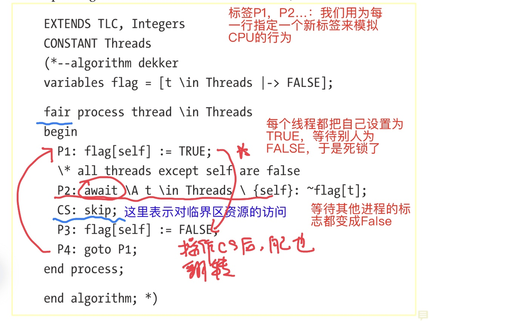
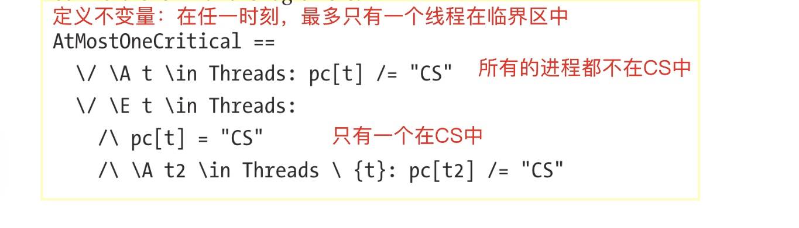
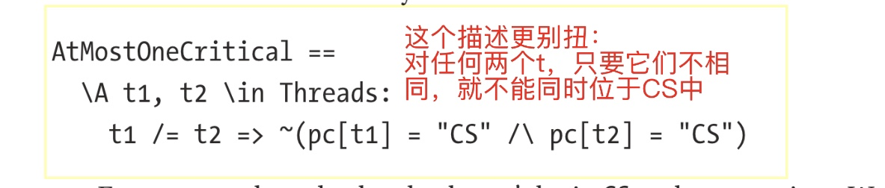
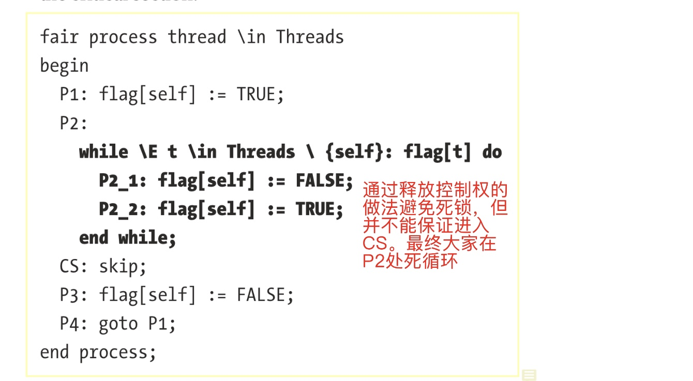

# 第6章 时间逻辑Temporal Logic

检查程序本身的行为（原文中叫`behavior`）。
1. 算法是否总能结束（**terminate**）
2. 队列中的消息是否都能得到处理
3. 当受到扰乱（**disrupted**）时，系统是否能够最终回到稳定的状态
4. 数据库是否满足最终一致性

## 6.1 终止Termination
检查算法是否最终能停止，而不会crash或陷入死循环

### 6.1.1 红绿灯的例子

一辆车和一个红绿灯，分别是两个process：`traffic light`切换信号灯，`car`在灯变绿之前一直等待


```
extColor(c) == CASE c = "red" -> "green"
                                [] c = ”green“ -> ”red“

(*--algorithm traffic 
variables   
    at_light = TRUE,   ❓at_light这个变量的作用不理解
    light = ”red“; 
process light = ”light“ 
begin   
    Cycle:     
        while at_light do       
            light := NextColor(light);     
        end while; 
end process; 

process car = ”car“ 
begin   
    Drive:     
       when light = ”green“;     
       at_light := FALSE;    ❓为什么要这里置为假？
end process; 

end algorithm;*)
```

> ⁉️这个例子中的`at_light`很奇怪，即使不考虑其他的因素，一旦`car`进程获得执行，它会被置为假，灯就再也没机会切换了。

这个例子执行到最后，终结在相同的状态：绿灯亮，trace显示＂stuttering＂。

### 6.1.2 stuttering
针对一种特别的场景：进程不执行。
stuttering不一定是错的，也可能是意味着诸如服务器崩溃，处理超时，或等待的信号从未到达等，
**liveness** checks：验证系统最终做了你希望它做的事情。

#### 6.1.2.1 公平Fairness，强公平和弱公平
**弱公平**：只要条件一直满足，它总会发生：if it stays enabled, eventually happen
**强公平**：若条件周期性被满足，则总会发生：if it’s repeatedly enabled, will eventually happen.

❗️我的理解是，两个的结果都是＂最终会发生＂，但条件不一样。弱公平的条件更苛刻一些：要一直满足（保持这个状态），而强公平的意思是，你不需要时刻保持这个使能状态。

下面例子中加了弱公平条件：
```
fair process light = "light"   ❗️加了fair
begin   Cycle:     
    while at_light do       
        light := NextColor(light);     
    end while; 
end process; 

fair process car = ”car“   ❗️
begin   
    Drive:     
        when light = ”green“;     
        at_light := FALSE; 
end process;
```

两个进程都要被设为fair：
* 若仅`car`为fair，那么灯可能永远不会切换
* 若仅`light`为fair，即使灯变亮了车也不会开

❗️但这个规格仍然会失败
> 作者的意思似乎是，若调度系统恰好始终让灯在红的时候调度车，车照样走不了
> 书中说：`fairness`仅仅保证当条件**始终**保持时总能得到机会，而这里的条件却是始终在enable和disable之间循环，这就不能保证了
> 是不是这个意思？

> 这个场景我倒是从未想过考虑过！

这就需要**强公平**要求。用`fair+`来表示


```
fair+ process car = "car" 
begin   
    Drive:     
        when light = ”green“;     
        at_light := FALSE; 
end process;
```
注意，light仍然需要为fair

## 6.2 Temporal Operators
### 6.2.1 []
表示**always**的意思。
`[]P`表示P在任何情况下都是True
在TLC中，把P声明为不变量计算效率更高

### 6.2.2 <>
表示**最终eventually**的意思。`<>P`表示总有一个状态P为True，之前它可能为False，之后也可能是False。
> 这里的`eventually`的更准确意思应该是，＂**终归会**＂的意思。它指的是存在一个状态，而并不是说这是最终的状态！

在之前的例子中，我们是这样定义初始状态的：
```
variables   
    at_light = TRUE,   
    light = ”red“;
```
从而`<>(light = “green”)`就是一个满足的时间属性。

但如果我们这样写：
```
variables   
    at_light = TRUE,   
    light = ”green“;
```
那么`<>(light = "red") `就不是一个可以满足的。TLC可以找到一种执行方式让它不成立。
> 🔆也就是说，最初的例子写的奇怪的地方就是其回的！它就是要让车运动之后灯就一直是绿色的。

`~<>P`意思是P永远不会为真，它和`[]~P`是等价的
`<>P`的正式定义就是`~[]~P`

前面的**termination**的正式定义是：最终所有进程都done(`eventually all processes are done`)：`Termination == <>(\A self \in ProcSet: pc[self] = ”Done“)`

### 6.2.3~>
它的意思是**leads-to**。
`P~>Q`表示如果某些状态下P为True，则Q或者现在或者在未来会变为True。并且，这种结果是不可更改的：即使以后P变成了False，Q仍然一定会发生

若我们写
`L == (light = ”green“) ~> ~at_light`
则下面几种情况下L为True：
* `light`从未变绿，或
* light变成绿色，而且某个时刻后car运行将at_light设成False

与`<>`不一样的是，每次P变为True时`~>`都会被触发

在原规格中，` (light = "red") ~> (light = "green")`会被满足，而若我们这样写就不会满足了：

```
Cycle:     
    while at_light do       
        light := NextColor(light);     
   end while;     
   light := ”red“;
```

灯的状态会是：红－〉绿－〉红，并且不会再变绿，因此规约不能被满足

`P ~> []Q`：若P为True，则存在某个状态Q变为True且永远为True

### 6.2.4 [ ]<> and <>[ ]
* `[]<>P`表示P**总是最终**为True（**always eventually** true）
* `<>[]P`表示P**最终总是**为True（**eventually always** true）
在有限状态（finite spec）下，两者是相同的。
在无限状态（infinite spec）下：
* `<>[]P`表示存在某些Point，P变为True且永远保持为True
* `[]<>P`表示若P曾经变为False，它最终仍会变成True

在前面的规格中，`[]<>(light = "green")`和`<>[](light = "green")`都是True，而`[]<>(light = "red")`和`<>[](light = "red")`为False。

若把light规格改为下面：

```
while TRUE do       
    light := NextColor(light);     
end while;
```
则`<>[](light = "green")`为False而`[]<>(light = "red")`为True

TLC也不支持`<>[]`和`[]<>`对`\in`

## 6.3 限制

实际上时间属性用得很少
计算很慢，**十分慢**
**do not combine temporal properties and symmetry sets. Regular sets of model constants are fine, but not symmetry sets. TLC optimizes symme**


## 6.4 Example

Dekker’s Algorithm：允许两个线程共亨一个资源而不会产生竞争条件。它保证两个线程最终都能完成更新，并且不需要使用任何CPU特定的指令。唯一用到的是共享内存。

### 6.4.1 模型描述

在本例中，原子性的粒度是单条的CPU指令，通过给每一行代码一个标签来模拟。




> ❗️这个例子仅适用于两个线程，三个或更多的线程会锁死的！

> `flag`是用来协商两个线程的共享变量，每个线程一个分量，初始化为False
> 每个进程先把自己置为True，然后等待其他线程的`flag`的分量为False
> 当完成对共享资源的访问后，把flag的对应分量置为False。

### 6.4.2 不变量的定义
描述为：在任一时刻，最多只有一个线程在临界区中
是否在临界区可以通过检查`pc`的值是否为`＂CS＂`来实现。
给出两种表述方式：

#### 6.4.2.1 第一种表述



> 两种情况：
> 1. 所有的进程都不在CS，或
> 2. 有且只有一个进程在CS中
> 注意TLA的描述方式：
> > 存在一个t，满足t在CS中，且对所有其他的进程t2，t2不在CS中

> 作者认为这个写法太`nave`，我倒觉得挺好懂的。反倒是下一个写法很费解


#### 6.4.2.2 写法2
对写法1，作者认为：为什么要把＂最多一个线程＂折成＂没有一个或只有一个＂？即下面的写法：



> 它的含义是：
> > 对`Threads`中的任意两个线程组合，它们不相同，则不它们不可能都在CS中。

执行：Threads <- 1..2, INVARIANT AtMostOneCritical, Deadlock.

会死锁：每个线程都会把自己的flag设为True，然后等对方变成False。

### 6.4.3 不成功的修改尝试

让每个线程在遇到冲突时不断将自己的flag设为False再改回True。
> 也即，指望自己释放的时候能让别人得到机会。



执行的结果满足规格：最多只有一个线程进入临界区，且没有死锁。

但还应检查线程是否能进入临界区。增加一个检查项：

```
Liveness ==   
    \A t \in Threads:     <>(pc[t] = ”CS“)
```
> 每个线程最终都能进入临界区
> 对照`<>`的定义：＂终归会有……＂

### 6.4.4 再次修改
算法修改：增加了一个表示下一个将被执行的线程标识`next_thread`，当冲突时，线程先释放自己，然后等待轮到自己执行。执行后再将执行权交给另一个线程。


> 实际上Dekker只适用两个线程。当线程数超过两个时就会失败。
> 另外的问题是缺乏韧性：若一个线程崩溃了，另一个线程也无法完成。


### 6.4.5 模拟线程崩溃


```
EXTENDS TLC, Integers, Sequences 
\* CONSTANT Threads 

Threads == 1..2 
(*--algorithm dekker 
variables   
    flag = [t \in Threads |-> FALSE],   
    next_thread \in Threads; 

❗️ 把行为抽取成procedure,供后面的两个过程共用
❗️行为和上一节的例子是一样的
procedure thread() 
begin   
    P1: flag[self] := TRUE;   
    P2:     
        while \E t \in Threads \ {self}: flag[t] do       
            P2_1:
                if next_thread /= self then           
                    P2_1_1: flag[self] := FALSE;           
                    P2_1_2: await next_thread = self;           
                    P2_1_3: flag[self] := TRUE; 
               end if;     
          end while;   
     CS: skip;   
     P3: next_thread := 3 - next_thread;
     P4: flag[self] := FALSE;   
     P5: goto P1; 
end procedure; 

❗️这个过程定义成fair的。
\* self is only defined for sets 
fair process fair_thread \in {1} 
begin   
    Fair:     
        call thread(); 
end process; 

❗️这个进程模拟会崩溃：只要不是fair就可以了
process crashable_thread \in {2} 
begin   
    Crashable:     
        call thread(); 
end process; 

end algorithm; *)
```
🔔 因为`self`只能用于集合，所以使用诸如`\in {1} `这样的写法。

要检查韧性，我们要检查当线程2崩溃后线程1是否还能进入临界区：

```
veness ==   
        \A t \in {1}:     <>(pc[t] = ”CS“)
```
规约执行失败：线程1会阻塞在`P2_1_1`处。

## 6.5
这一章的例子是比较难理解的。


