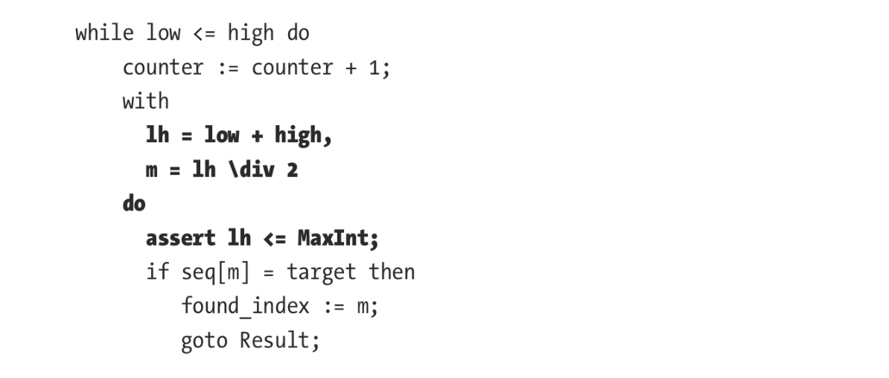
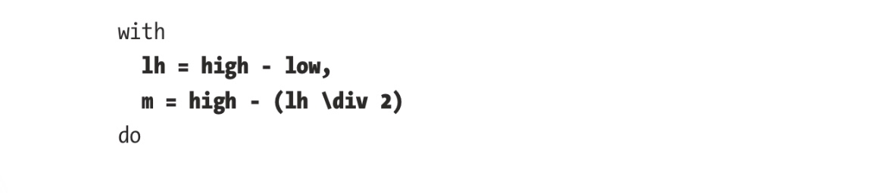

# 第7章 算法验证

这一章会讲述如何用TLA+编写和验证算法。
所谓验证算法，指的是算法会终止且输出结果，而不是一直跑下去或不断与环境交互

## 7.1 单过程（Single-Process）算法
模板：

```
---- MODULE name ---- 
EXTENDS \* whatever 

Expected(input) == \* ...

Helpers == \* ...

(*--algorithm name 
variables   
    input \in \* ...
    output; \* ...
    \* helper variables
    
begin   
    \* algorithm implementation   
        assert output = Expected(input); 
end algorithm; *) 
====
```
内容：
* Expected
* Helpers
* inputs
* output

## 7.2 Max
### 7.2.1 算法分析设计
计算一个`sequence`的最大值。例如：`max(<<1, 1, 2, -1>>) = 2`

首先定义operator：`CHOOSE x \in set: \A y \in set: y <= x`

因此

```
ExTENDS Sequences 

Max(seq) ==   
    LET set == { seq[i]: i \in 1..Len(seq)}   
    IN CHOOSE x \in set: \A y \in set: y <= x
```
还可以进一步优化效率：

```
Max(seq) ==   
    LET index ==     
        CHOOSE x \in 1..Len(seq):       
            \A y \in 1..Len(seq): seq[y] <= seq[x]   
    IN seq[index]
```
> 这个所谓的提升好像是把index给优化了？

最终形成的算法就是：

```
EXTENDS Integers, Sequences, TLC 
CONSTANTS IntSet, MaxSeqLen 
ASSUME IntSet \subseteq Int 
ASSUME MaxSeqLen > 0 

PT == INSTANCE PT

Max(seq) ==   
    LET set == {seq[i]: i \in 1..Len(seq)}   
    IN CHOOSE x \in set: \A y \in set: y <= x 

AllInputs == PT!SeqOf(IntSet, MaxSeqLen) 

(*—algorithm max 
variables seq \in AllInputs, i = 1, max; 
begin   
    max := seq[1];   
    while i <= Len(seq) do     
        if max < seq[i] then       
            max := seq[i];     
        end if;     
        i := i + 1;   
   end while;   
   assert max = Max(seq); 
end algorithm; *)
```
> 外面的`Max`是用于检查算法正确性的＂标准＂，而`algorithm`中才是我们要检查正确性的＂算法＂！差点喧宾夺主了


### 7.2.2 构造输入数据测试

在ToolBox中设置：

```
defaultInitValue <- [ model value ] 
IntSet <- -5..5 
MaxSeqLen <- 5
```
执行失败。错误信息显示试图计算`<<>>[1]`。
修改：

```
❗️在AllInput中去掉空集
AllInputs == PT!SeqOf(IntSet, MaxSeqLen) \ {<<>>}
(*--algorithm max 
variables seq \in AllInputs, i = 1, max;
begin   
❗️增加assert断言
    assert Len(seq) > 0;   
    max := seq[1];
```
> 书上说，这个输入下的状态有1,576,685个😱
> 的确这个数量很惊人
> 因此，我觉的，我们在对算法验证时必须要对输入做简化和抽象。同时，我认为企图黑盒方式搞自动化的形式化验证也是有问题的。傻瓜式的工具不能代替人的抽象思维能力


## 7.3 Laft pad
Leftpad指的是根据长度填充字符串，例如：
`Leftpad(” “, 5, ”foo“) = ” foo“`，而`Leftpad(” “, 1, ”foo“) = ”foo“`

### 7.3.1 建模
用字符串序列来代替字符串，因为它在TLA+中操作起来更方便
`Leftpad(c, n, str)`，其完整的规格：
1. `Len(Leftpad(c, n, str)) = Max(n, Len(str))`
2. 输出的后面部分为`str`
3. 在`str`之前的字符(若有)为`c`

即规格如下：

```
Leftpad(c, n, str) ==   
    LET     
        outlength == PT!Max(Len(str), n)     
        padlength ==       
            CHOOSE padlength \in 0..n:         
                padlength + Len(str) = outlength   
      IN     
          [x \in 1..padlength |-> c] \o str
```
> `\o`是`combine`运算
> TLA中的描述性规格很怪异

为了减少无谓的状态空间的大小，我们仅选择有限的字符集进行测试。

```
Characters == {"a", "b", "c"} 

(*--algorithm leftpad 
variables   
    in_c \in Characters \union {” “},   
    in_n \in 0..6,   
    in_str \in PT!SeqOf(Characters, 6),   
    output; 

begin   
    output := in_str;   
    while Len(output) < in_n do     
        output := <<in_c>> \o output;
    end while;   
    assert output = Leftpad(in_c, in_n, in_str); 
end algorithm; *)
```
> 这里，这个算法的实现其实挺笨的 😅
> >  `in_c`是要用来填充的字符
> >  `in_n`是长度
> >  `in_str`是输入字符串，`PT!SeqOf`这个函数

仅仅三个字符就总共有125，632种状态！

试一下如果算法写错了。把`Len(output) < in_n`改为`Len(output) <= in_n`？

另外一个不常见的错误情况是把`in_n \in 0..6`写成了`in_n \in -1..6`。因为0..-1是空集，`padlength`的值是未定义的。这可能是因为我们给出的定义是错的，因为负数个数的pad定义是无意义的，也可能规格就是错误的。Leftpad填充的字符的个数不应是负的。

比如，我们规定若`n`是负数就不做任何填充：

```
Leftpad(c, n, str) ==   
    ✍🏻修改这里
    IF n < 0 THEN str ELSE   
    LET     
        outlength == PT!Max(Len(str), n)     
        padlength ==       
            CHOOSE padlength \in 0..n:         
                padlength + Len(str) = outlength   
    IN     
        [x \in 1..padlength |-> c] \o str
```

若`Leftpad`支持`n`为负数，那就是我们的规格是错的，我们要加上检查：

```
(*--algorithm leftpad 
variables   
    in_c \in Characters \union {” “},   
    in_n \in 0..6,   
    in_str \in PT!SeqOf(Characters, 6),   
    output; 
begin   
    assert in_n >= 0;   
    output := in_str;   
    while Len(output) < in_n do     
        output := <<in_c>> \o output;
    end while;   
    
    assert output = Leftpad(in_c, in_n, in_str); 
end algorithm; *)
```

## 7.4 算法的属性

验证算法的正确性很容易，而要验证性能等就困难了。
可以加一些辅助变量并在计算结束后检查。

考虑二分法算法，要验证它的复杂度是$log_2(n)$。

先写一个（所谓的）“binary search”，由于二分法是对排序的序列进行搜索，我们用`PT!SeqOf`生成序列并过滤掉无序的
> 这才是我真正应学习的东西
> 但，这个性能该有多差啊！😓

```
OrderedSeqOf(set, n) ==   
    {  seq \in PT!SeqOf(set, n):     
            \A x \in 2..Len(seq):       
                seq[x] >= seq[x-1] }
      
MaxInt == 4 
Range(f) == {f[x]: x \in DOMAIN f} 
 
(*—algorithm definitely_binary_search 
variables 
    i = 1,           
    seq \in OrderedSeqOf(1..MaxInt, MaxInt),
    target \in 1..MaxInt,
    found_index = 0; 
begin
    Search:
        while i <= Len(seq) do
            if seq[i] = target then
                found_index := i;
                goto Result;
            else
                i := i + 1;
            end if;
        end while;
    Result:
        if target \in Range(seq) then
           assert seq[found_index] = target;
        else
            \* 0 is out of DOMAIN seq, so can represent ”not found“       
            assert found_index = 0;
        end if; 
end algorithm; *)
```
> 这个当然不是二分法！

接下来要检查复杂度。
用`while `循环的次数作为粗略的搜索次数，因为TLA不支持浮点数，所以用其反函数：`Pow2`：

```
Pow2(n) ==   
    LET f[x \in 0..n] ==     
        IF x = 0     
            THEN 1     
       ELSE 2*f[x-1]   
    IN f[n]
```
这样，我们可以断言：`Pow2(counter-1) <= Len(seq)`


```
variables 
    i = 1,
    seq \in OrderedSeqOf(1..MaxInt, MaxInt),
    target \in 1..MaxInt,
    found_index = 0,
    counter = 0; 🔆新增的次数计数器
Search: 
    while i <= Len(seq) do
        counter := counter + 1;   🔆
        if seq[i] = target then
            found_index := m;
            goto Result;
        end if;
        i := i + 1   
    end while; 
Result:   
    ⚠️在这里增加检查
    if Len(seq) > 0 then     
        assert Pow2(counter-1) <= Len(seq);   
    end if;   
    if target \in PT!Range(seq) then     
        assert seq[found_index] = target;   
   else     
       assert found_index = 0;   
  end if;
```
下面才是真正的二分法：

```
(*--algorithm binary_search 
variables 
    low = 1,           
    seq \in OrderedSeqOf(1..MaxInt, MaxInt),
    high = Len(seq),
    target \in 1..MaxInt,
    found_index = 0,
    counter = 0; 
    
begin 
Search:
    while low <= high do
        counter := counter + 1; 
        with
            m = (high + low) \div 2 
            do
                if seq[m] = target then
                    found_index := m;
                    goto Result;
                elsif seq[m] < target then
                   low := m + 1;
                else
                    high := m - 1;
                end if;
           end with;
      end while;
Result:
    if Len(seq) > 0 then
         assert Pow2(counter-1) <= Len(seq);
    end if;
    if target \in Range(seq) then
        assert seq[found_index] = target;
    else
        assert found_index = 0;
    end if; 
end algorithm; *)
```

上面例子中有一个微妙的错误：`low + high`可能会超过机器上的整数的范围。下面检查了：



这样会失败。可以改成：



给一个专门用于检查溢出的不变量：

```
NoOverflows ==   
    \A x \in {m, lh, low, high}:     
        x <= MaxInt
```

## 7.5 多处理器算法（还是多进程算法？）

在所有的进程结束时检查断言
使用“eventually always” (<>[]) operator来检查
若不想模拟算法中途崩溃的情况，则使用`fair`

```
EXTENDS Integers, Sequences, TLC 

(*--algorithm counter_incrementer 
variables   
    counter = 0,
    goal = 3;
    
define   
    Success == <>[](counter = goal)
end define; 

fair process incrementer \in 1..3 
variable 
    local = 0 
begin   
    Get:     
        local := counter;
    Increment:     
        counter := local + 1; 
end process; 

end algorithm; *)
```
This, unsurprisingly, fails, as our processes can increment based off stale memory. 
If we merge the two labels into one label, this succeeds with 22 states.
