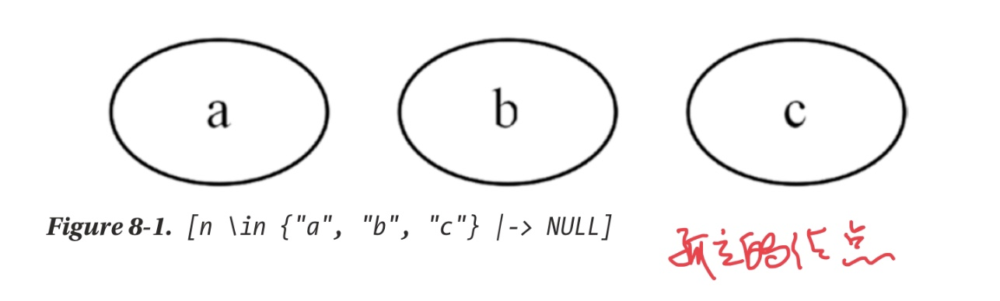
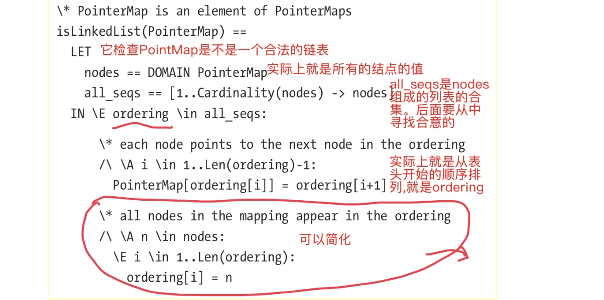
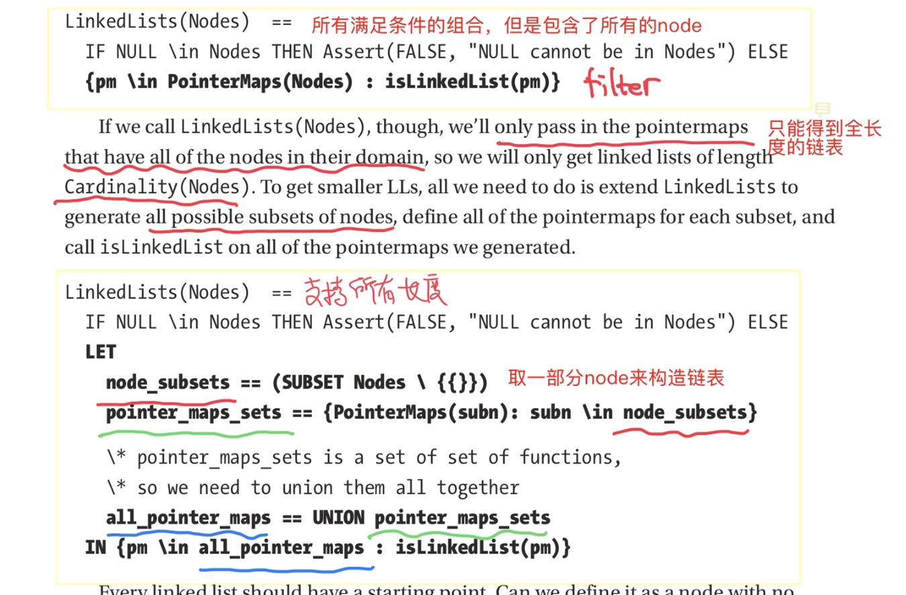
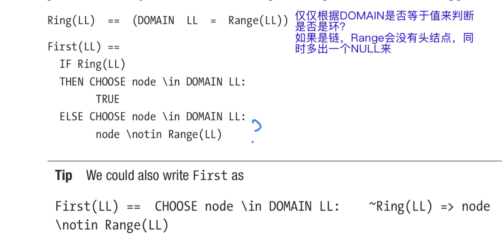
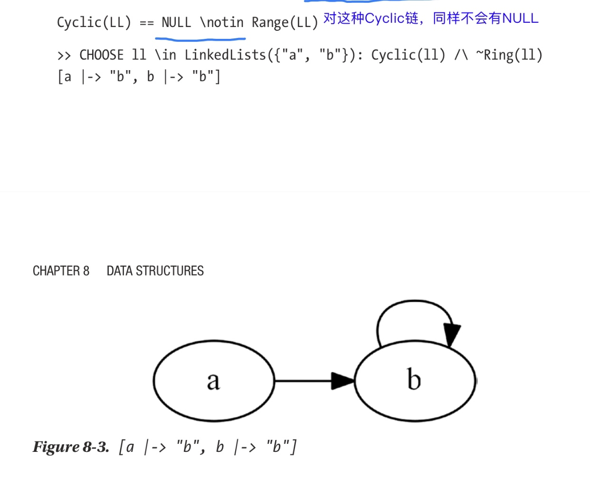
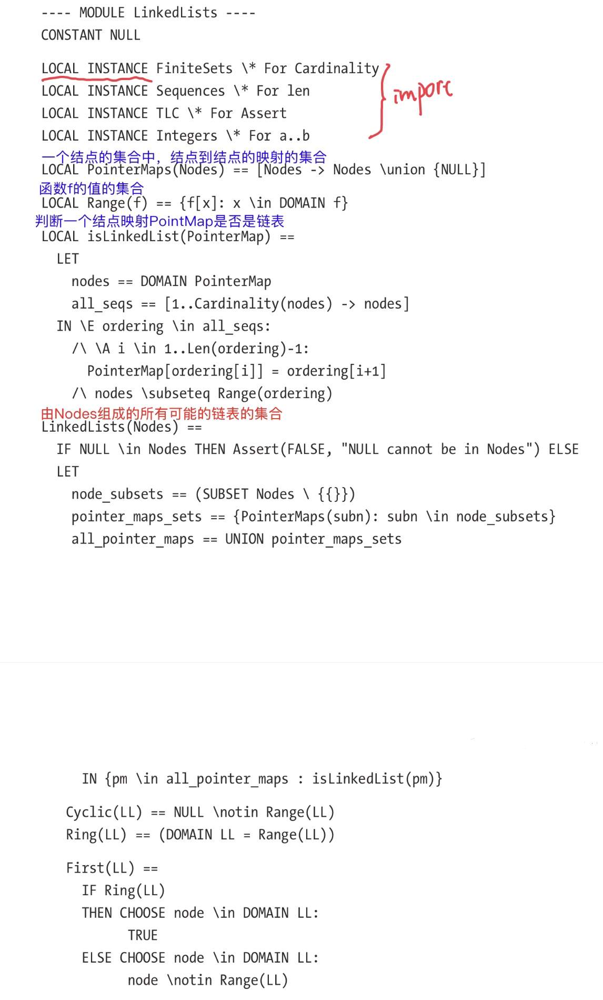
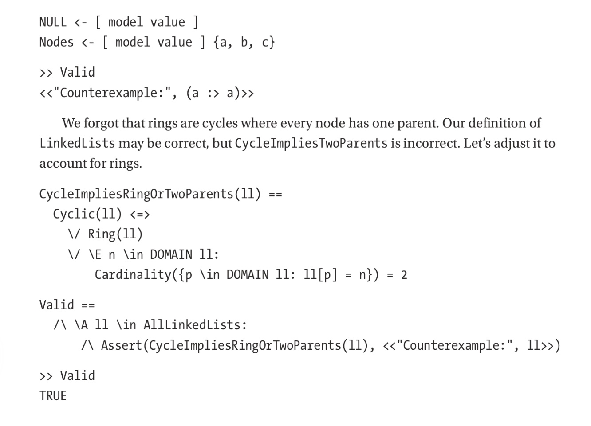

# 第8章 数据结构
linked list，LL，链表

## 8.1 规格定义
TLA中，一般把数据结构表示为函数或结构（它实际也是函数）。
为了方便，module应有一个叫`LinkedLists(Nodes)`的operator，来生成所有的有效的链表集合。它是一个function set形式：`[Nodes -> Nodes]`

一步步来
先定义所有可能的结点的映射：

```
PointerMaps(Nodes) == [Nodes -> Nodes] 
LinkedLists(Nodes) == \* ...
```
然后考虑链尾（`final node`），它指向一个null，因此我们要定义NULL，在`CONSTANT `里定义，并且要确保没有结点为NULL一一需要断言，使用`TLC`中的`Assert`。我们会用`LOCAL INSTANCE`来替代之前常用的`EXTENDS`，这样以后任何extend了LinkedList.tla的规格也都用不着也导入TLC的其他算子

> 这句话有点费解，我猜测他的意思是说，不用`EXTENDS TLC`，就不会把TLC中的其他的operator也import进来了，从而不会产生预料之外的名字污染？


```
CONSTANT NULL 
LOCAL INSTANCE TLC \* For Assert 

PointerMaps(Nodes) == [Nodes -> Nodes \union {NULL}] 

LinkedLists(Nodes) ==   
    IF NULL \in Nodes THEN Assert(FALSE, ”NULL cannot be in Nodes“) ELSE   
    \* ...
```

`PointerMaps`是所有的可能的节点的映射，但并非所有的映射都是链表。所以还要去掉无效的映射。比如，`[n \in Nodes |-> NULL]`，它不是链表。


要识别出有效的链表，利用链表的定义：从链表头开始可以遍历到所有的节点，并且最后一个节点指向NULL

一种方法是使用`PT!ReduceSet`，从表头开始遍历。但第一`ReduceSet`很难用对，另外还要求找到表头

更好的做法来自于一个事实：一个LL中从头开始的结点组成了一个Sequence，Sequence 中结点的顺序也是链表中的顺序。例如，某个LL是`[a |-> b, b |-> NULL, c |-> a]`，那么它对应的Sequence 是`<<c, a, b>>`。
另一方面，所有的结点都必须在Sequence 中，例如，对`[a |-> NULL, b |-> NULL]`来说，得到序列`<<a>>`或`<<b>>`，我们就说它不是一个有效的LL。



这个可以进一步优化为

```
\* While Range is defined in PT, we don't want 
\* a generic module reliant on PT! 

Range(f) == {f[x]: x \in DOMAIN f} 
isLinkedList(PointerMap)      ==
    LET     
        nodes == DOMAIN PointerMap
        all_seqs == [1..Cardinality(nodes) -> nodes]
   IN \E ordering \in all_seqs: 
       /\ \A i \in 1..Len(ordering)-1:  
           PointerMap[ordering[i]] = ordering[i+1]
      /\ nodes \subseteq Range(ordering)
```

`LinkedLists`就得到所有的LL：

```
LinkedLists(Nodes)  ==   
    IF NULL \in Nodes THEN Assert(FALSE, ”NULL cannot be in Nodes“) ELSE 
        {pm \in PointerMaps(Nodes) : isLinkedList(pm)}
```

但是这个版本的`LinkedLists`只能得到包含了所有结点的链表。 若要想得到较小的链表，则应取`Nodes`的所有的子集。



> 对比上下两个算法

一般的链表，表头没有任何其他的结点指向它，若是环，就不存在这样的节点。

下面选择表头：
* 若是环，则任选一个结点


> 仔细看一下选择表头的算法：表头是不在序列的值中的那个域值：因为没有结点指向它

同样看一下 环的判别方式。是否是说，值中没有NULL的就一定是环呢？也不一定。

If, for your spec, you want data structures that match specific criteria, it’s common practice to get them by first defining a operator that tests if a given instance matches those criteria and then using that operator in conjunction with set filters and CHOOSE

这里的意思是，若你想让定义你的数据结构，一种有用的检查你的定义是否正确的方法是先定义一个`operator `来检查一个数据实例是否满足你的定义，然后把它和集合过滤和`CHOOSE`结合起来。

下面我们找出了不是环的循环链表。



> 上面是啥目的呢？

最终：



## 8.2 验证
为了验证`LinkedList`，在一个规格中导入`LinkedLists`并定义一些evaluation operator，比如`Valid`。
> 前面作者要把它放在单独的root项目文件中

要验证的地方：
* 有循环的LL
* 没有循环的LL
* 对结点的每个子集，都存在包含了所有结点的环
> 如果环没有包括所有的结点，就是前面的循环结构LL了
* 所有的最多只有一个没有父亲的结点，最多一个结点有两个父亲（一种循环结构），以及没有结点有多于两个父亲的LL


```
---- MODULE main ---- 
EXTENDS TLC, Integers, FiniteSets, Sequences 
CONSTANTS Nodes, NULL

INSTANCE LinkedLists WITH NULL <- NULL 

AllLinkedLists == LinkedLists(Nodes) 

CycleImpliesTwoParents(ll) ==   
    Cyclic(ll) <=>     
        \E n \in DOMAIN ll:
            Cardinality({p \in DOMAIN ll: ll[p] = n}) = 2 
            
Valid ==   
    /\ \A ll \in AllLinkedLists:       
        /\ Assert(CycleImpliesTwoParents(ll), <<”Counterexample:“, ll>>)
        
====
```

这就够了，不需要行为规约。





